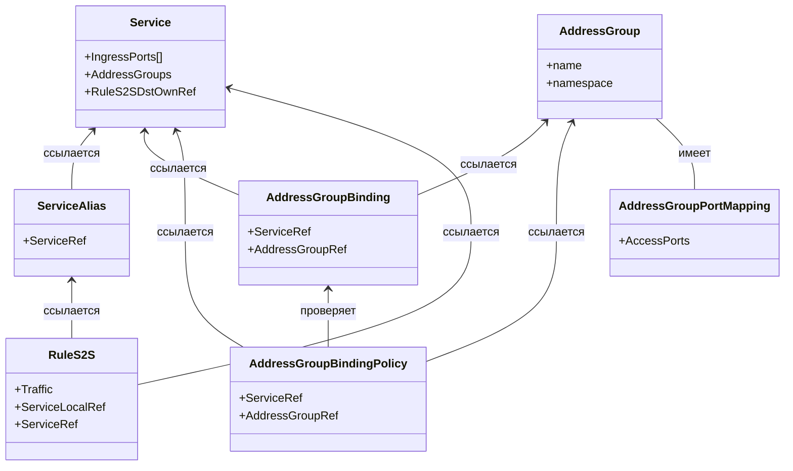

# Сценарии взаимодействия сущностей в системе Netguard

## Введение

Данная документация описывает основные сценарии взаимодействия между сущностями в системе Netguard. Каждый сценарий представляет собой последовательность действий и проверок, которые выполняются при создании, обновлении или удалении ресурсов.

## Основные сущности

В системе Netguard используются следующие основные сущности:

1. **Service** - представляет сервис, который может быть доступен через определенные порты и протоколы.
2. **ServiceAlias** - представляет алиас для сервиса, позволяющий создавать дополнительные имена для одного и того же сервиса.
3. **AddressGroup** - группа адресов, к которой могут быть привязаны сервисы.
4. **AddressGroupPortMapping** - содержит информацию о портах, которые используются сервисами в рамках группы адресов.
5. **AddressGroupBinding** - связывает сервис с группой адресов, определяя правила доступа.
6. **AddressGroupBindingPolicy** - определяет политику, разрешающую кросс-неймспейс привязки между сервисами и группами адресов.
7. **RuleS2S** - определяет правила взаимодействия между сервисами в разных неймспейсах, на основе которых создаются правила IEAgAgRule в провайдере.

## Правила взаимодействия

Взаимодействие между сущностями в системе Netguard регулируется следующими правилами:

1. **Проверка существования ресурсов**: Перед созданием связей между ресурсами система проверяет, что все ссылаемые ресурсы существуют.
2. **Проверка перекрытия портов**: Система предотвращает конфликты портов между сервисами в одной группе адресов.
3. **Кросс-неймспейс политики**: Для создания привязки между сервисом и группой адресов из разных неймспейсов требуется наличие соответствующей политики.
4. **Защита от удаления используемых ресурсов**: Система блокирует удаление политик, на которые есть активные ссылки.
5. **Неизменность ключевых полей**: После создания ресурсов их ключевые поля (ссылки на другие ресурсы) не могут быть изменены.

## Список сценариев

1. [Создание привязки AddressGroupBinding в том же неймспейсе](scenarios/scenario_1.md)
2. [Создание привязки AddressGroupBinding между разными неймспейсами](scenarios/scenario_2.md)
3. [Создание политики AddressGroupBindingPolicy](scenarios/scenario_3.md)
4. [Обновление AddressGroupPortMapping](scenarios/scenario_4.md)
5. [Удаление политики AddressGroupBindingPolicy](scenarios/scenario_5.md)
6. [Проверка перекрытия портов при создании привязки](scenarios/scenario_6.md)
7. [Обновление привязки AddressGroupBinding](scenarios/scenario_7.md)
8. [Создание и использование ServiceAlias](scenarios/scenario_8.md)
9. [Создание правила RuleS2S для взаимодействия между сервисами](scenarios/scenario_9.md)

## Общая схема взаимодействия

## Заключение

Представленные сценарии и правила обеспечивают целостность системы и предотвращают возникновение несогласованных состояний при управлении сетевыми политиками. Механизмы валидации и проверки зависимостей гарантируют, что все изменения в конфигурации сети выполняются безопасно и предсказуемо.
