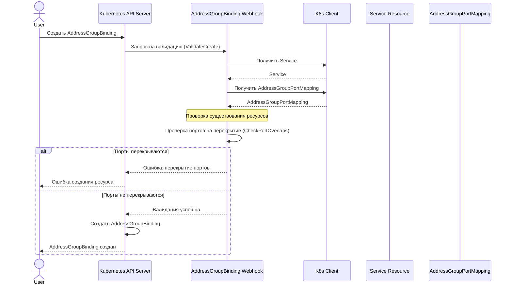

# Сценарий 1: Создание привязки AddressGroupBinding в том же неймспейсе

## Описание
В этом сценарии пользователь создает привязку (AddressGroupBinding) между Service и AddressGroup, находящимися в одном и том же неймспейсе. Система проверяет существование обоих ресурсов и отсутствие конфликтов портов.

## Последовательность действий

## Детали реализации

1. Пользователь отправляет запрос на создание ресурса AddressGroupBinding через Kubernetes API.
2. API-сервер вызывает валидационный вебхук для AddressGroupBinding.
3. Вебхук проверяет:
   - Существование Service в том же неймспейсе
   - Существование AddressGroupPortMapping (который имеет то же имя, что и AddressGroup)
   - Отсутствие перекрытий портов между Service и другими сервисами, уже связанными с AddressGroup
4. Если все проверки пройдены успешно, ресурс создается.
5. Если обнаружены перекрытия портов или отсутствуют необходимые ресурсы, возвращается ошибка.