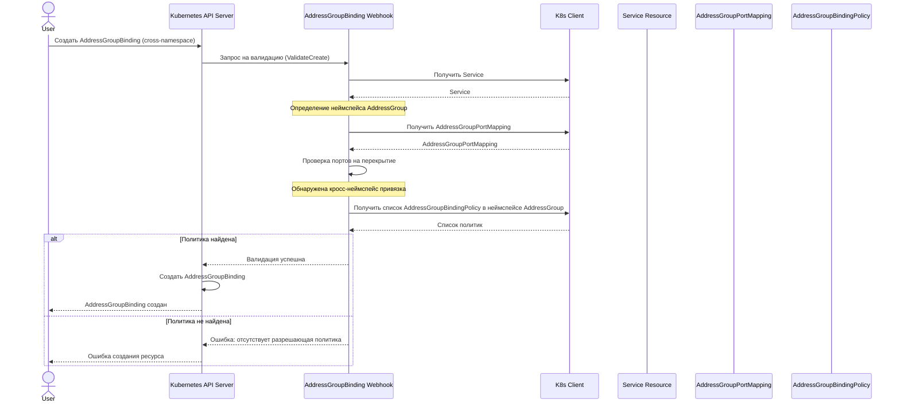

# Сценарий 2: Создание привязки AddressGroupBinding между разными неймспейсами

## Описание
В этом сценарии пользователь пытается создать привязку между Service и AddressGroup, находящимися в разных неймспейсах. Для успешного создания такой привязки должна существовать соответствующая политика (AddressGroupBindingPolicy) в неймспейсе AddressGroup.

## Последовательность действий

## Детали реализации

1. Пользователь отправляет запрос на создание ресурса AddressGroupBinding, указывая AddressGroup из другого неймспейса.
2. API-сервер вызывает валидационный вебхук для AddressGroupBinding.
3. Вебхук проверяет:
   - Существование Service в неймспейсе привязки
   - Существование AddressGroupPortMapping в неймспейсе AddressGroup
   - Отсутствие перекрытий портов между Service и другими сервисами
   - Наличие AddressGroupBindingPolicy в неймспейсе AddressGroup, разрешающей данную привязку
4. Если все проверки пройдены успешно, ресурс создается.
5. Если отсутствует разрешающая политика или не пройдены другие проверки, возвращается ошибка.

## Особенности безопасности

Механизм политик (AddressGroupBindingPolicy) обеспечивает контроль доступа между неймспейсами, предотвращая несанкционированное использование AddressGroup из других неймспейсов. Политика должна быть создана администратором неймспейса, содержащего AddressGroup.