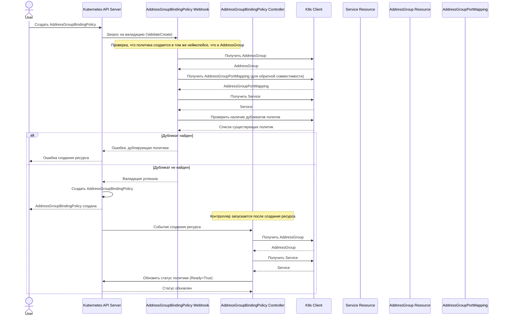

# Сценарий 3: Создание политики AddressGroupBindingPolicy

## Описание
В этом сценарии пользователь создает политику, разрешающую кросс-неймспейс привязки. Политика должна быть создана в том же неймспейсе, что и AddressGroup, и ссылаться на существующие Service и AddressGroup.

## Последовательность действий

## Детали реализации

1. Пользователь отправляет запрос на создание ресурса AddressGroupBindingPolicy через Kubernetes API.
2. API-сервер вызывает валидационный вебхук для AddressGroupBindingPolicy.
3. Вебхук проверяет:
   - Что политика создается в том же неймспейсе, что и AddressGroup
   - Существование AddressGroup в неймспейсе политики
   - Существование AddressGroupPortMapping в неймспейсе политики (для обратной совместимости)
   - Существование Service в указанном неймспейсе
   - Отсутствие дублирующих политик для той же пары Service-AddressGroup
4. Если все проверки пройдены успешно, ресурс создается.
5. Если обнаружены дубликаты или отсутствуют необходимые ресурсы, возвращается ошибка.
6. После создания ресурса контроллер AddressGroupBindingPolicy:
   - Проверяет существование Service и AddressGroup напрямую (без использования промежуточных ресурсов)
   - Обновляет статус политики, устанавливая условия (conditions):
     - AddressGroupFound: указывает, найдена ли группа адресов
     - ServiceFound: указывает, найден ли сервис
     - Ready: указывает, что политика валидна и готова к использованию
   - Не создает ресурсы AddressGroupBinding напрямую (это делается через контроллер AddressGroupBinding)

## Особенности безопасности

1. Политика должна быть создана в том же неймспейсе, что и AddressGroup, чтобы обеспечить контроль доступа со стороны владельцев AddressGroup.
2. Система предотвращает создание дублирующих политик, чтобы избежать неоднозначности в правилах доступа.
3. Проверка существования ресурсов гарантирует, что политика не будет создана для несуществующих объектов.
