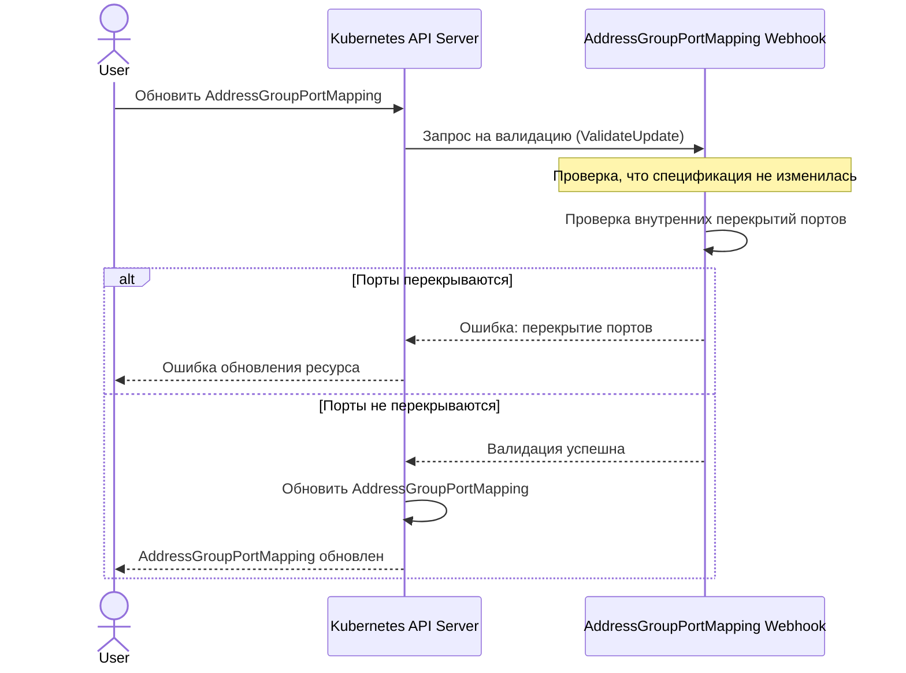

# Сценарий 4: Обновление AddressGroupPortMapping

## Описание
В этом сценарии система проверяет, что при обновлении AddressGroupPortMapping не возникает конфликтов портов между сервисами. Этот ресурс содержит информацию о портах, которые используются различными сервисами в рамках одной группы адресов.

## Последовательность действий

## Детали реализации

1. Пользователь отправляет запрос на обновление ресурса AddressGroupPortMapping через Kubernetes API.
2. API-сервер вызывает валидационный вебхук для AddressGroupPortMapping.
3. Вебхук проверяет:
   - Что спецификация ресурса не изменилась (должна оставаться пустой)
   - Отсутствие перекрытий портов между сервисами внутри этого ресурса
4. Для проверки перекрытий портов вебхук:
   - Создает карты диапазонов портов для TCP и UDP протоколов
   - Проверяет каждый порт каждого сервиса на перекрытие с портами других сервисов
   - Учитывает как одиночные порты, так и диапазоны портов
5. Если все проверки пройдены успешно, ресурс обновляется.
6. Если обнаружены перекрытия портов, возвращается ошибка.

## Технические особенности

1. AddressGroupPortMapping имеет пустую спецификацию, а основные данные хранятся в поле `accessPorts`.
2. Система предотвращает конфликты портов, которые могли бы привести к неоднозначности в правилах доступа.
3. Проверка перекрытий портов учитывает протокол (TCP/UDP), поэтому одинаковые порты разных протоколов не считаются конфликтующими.