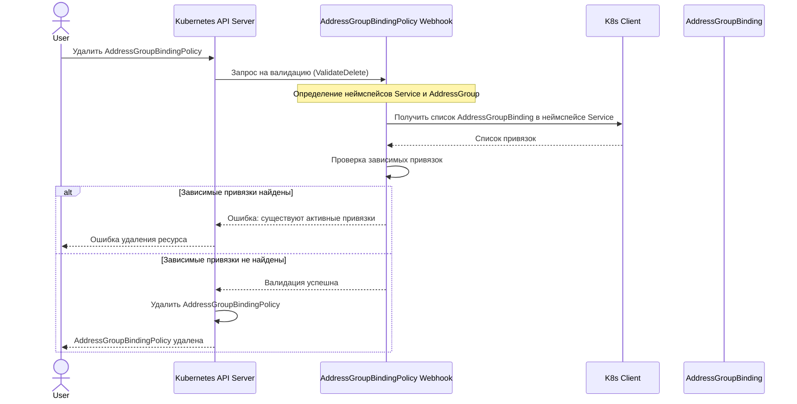

# Сценарий 5: Удаление политики AddressGroupBindingPolicy

## Описание
В этом сценарии система проверяет, что при удалении политики не существует активных привязок, которые зависят от этой политики. Это предотвращает нарушение работы существующих кросс-неймспейс привязок.

## Последовательность действий

## Детали реализации

1. Пользователь отправляет запрос на удаление ресурса AddressGroupBindingPolicy через Kubernetes API.
2. API-сервер вызывает валидационный вебхук для проверки возможности удаления.
3. Вебхук определяет:
   - Неймспейс AddressGroup (совпадает с неймспейсом политики)
   - Неймспейс Service (указан в политике)
4. Вебхук проверяет наличие AddressGroupBinding в неймспейсе Service, которые:
   - Ссылаются на тот же Service, что и политика
   - Ссылаются на тот же AddressGroup, что и политика
   - Являются кросс-неймспейс привязками (неймспейс AddressGroup отличается от неймспейса Service)
5. Если найдены зависимые привязки, удаление блокируется с ошибкой.
6. Если зависимых привязок нет, политика удаляется.

## Особенности безопасности

1. Механизм защиты от удаления используемых политик предотвращает нарушение работы существующих привязок.
2. Перед удалением политики необходимо удалить все зависящие от нее привязки.
3. Этот механизм обеспечивает целостность системы и предсказуемое поведение при изменении конфигурации.