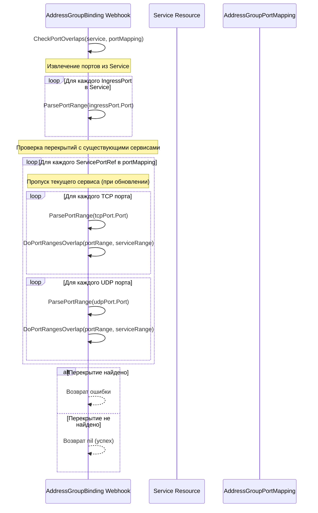

# Сценарий 6: Проверка перекрытия портов при создании привязки

## Описание
Этот сценарий детализирует процесс проверки перекрытия портов при создании привязки между Service и AddressGroup. Это критически важная проверка, которая предотвращает конфликты портов между различными сервисами в одной группе адресов.

## Последовательность действий



## Детали реализации

1. Функция `CheckPortOverlaps` принимает два аргумента:
   - `service`: Сервис, для которого создается привязка
   - `portMapping`: Существующий AddressGroupPortMapping для AddressGroup

2. Процесс проверки включает следующие шаги:
   - Извлечение всех портов из Service и преобразование их в структуры PortRange
   - Создание карты портов по протоколам (TCP/UDP)
   - Перебор всех сервисов в portMapping (кроме текущего сервиса при обновлении)
   - Для каждого сервиса проверка перекрытия его TCP и UDP портов с портами текущего сервиса

3. Функция `ParsePortRange` преобразует строковое представление порта (например, "80" или "8080-9090") в структуру с началом и концом диапазона.

4. Функция `DoPortRangesOverlap` проверяет, перекрываются ли два диапазона портов, используя простое условие:
   ```
   a.Start <= b.End && a.End >= b.Start
   ```

## Технические особенности

1. Система поддерживает как одиночные порты, так и диапазоны портов.
2. Проверка перекрытий учитывает протокол (TCP/UDP), поэтому одинаковые порты разных протоколов не считаются конфликтующими.
3. При обновлении привязки текущий сервис исключается из проверки, чтобы избежать ложных срабатываний.
4. Если обнаружено перекрытие, функция возвращает подробную ошибку с указанием конфликтующих портов и сервисов.
