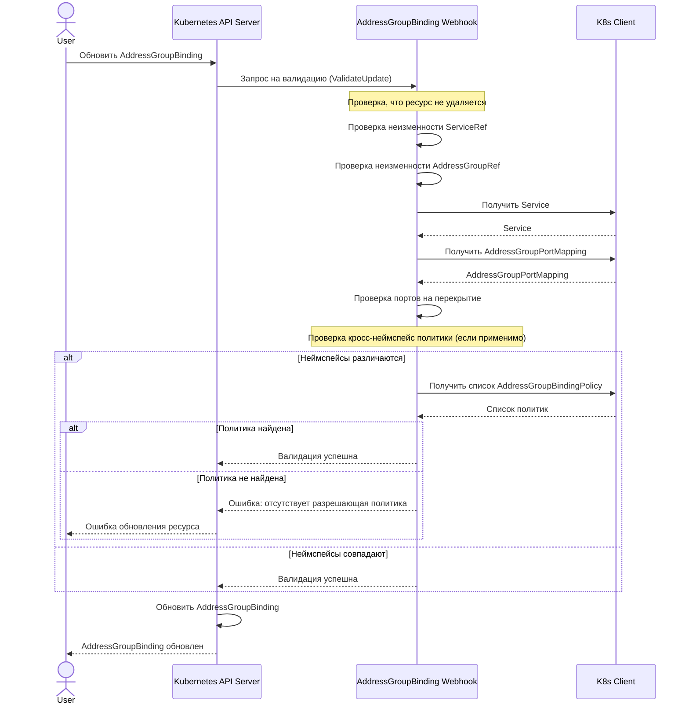

# Сценарий 7: Обновление привязки AddressGroupBinding

## Описание
В этом сценарии система проверяет, что при обновлении привязки не изменяются ключевые поля и сохраняются все необходимые условия. Это обеспечивает целостность системы и предотвращает непредвиденные изменения в конфигурации сети.

## Последовательность действий

## Детали реализации

1. Пользователь отправляет запрос на обновление ресурса AddressGroupBinding через Kubernetes API.
2. API-сервер вызывает валидационный вебхук для AddressGroupBinding.
3. Вебхук проверяет:
   - Что ресурс не находится в процессе удаления (DeletionTimestamp не установлен)
   - Что ключевые поля (ServiceRef и AddressGroupRef) не изменились
   - Существование Service в неймспейсе привязки
   - Существование AddressGroupPortMapping в неймспейсе AddressGroup
   - Отсутствие перекрытий портов между Service и другими сервисами
   - Наличие AddressGroupBindingPolicy в неймспейсе AddressGroup (для кросс-неймспейс привязок)
4. Если все проверки пройдены успешно, ресурс обновляется.
5. Если какая-либо проверка не пройдена, возвращается ошибка.

## Технические особенности

1. Неизменность ключевых полей (ServiceRef и AddressGroupRef) после создания ресурса обеспечивает стабильность конфигурации.
2. Повторная проверка существования ресурсов и отсутствия перекрытий портов гарантирует, что обновление не нарушит работу системы.
3. Для кросс-неймспейс привязок проверяется наличие разрешающей политики, даже если она была проверена при создании (политика могла быть удалена).
4. Проверка на удаление (DeletionTimestamp) позволяет пропустить валидацию для ресурсов, которые находятся в процессе удаления.