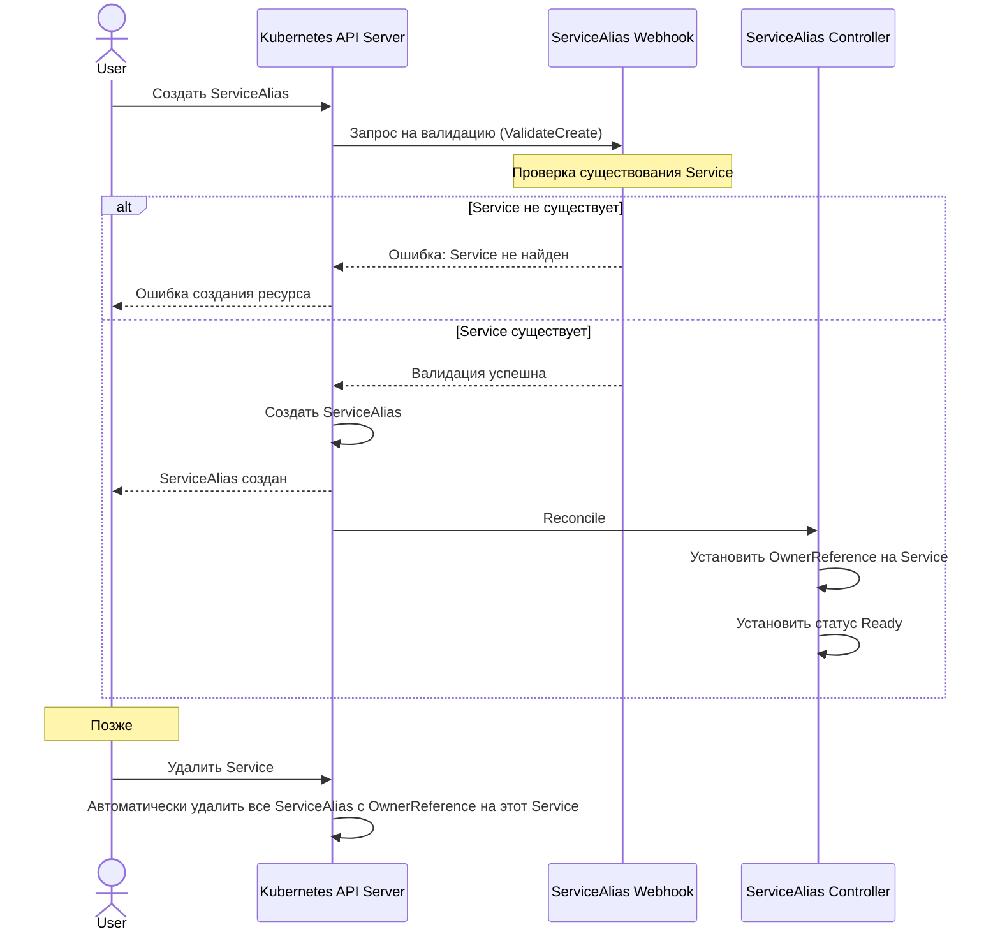

# Сценарий 8: Создание и использование ServiceAlias

## Описание
В этом сценарии система обрабатывает создание и использование алиасов для сервисов. ServiceAlias позволяет создавать дополнительные имена для одного и того же сервиса в рамках одного неймспейса. При удалении Service все связанные ServiceAlias удаляются автоматически.

## Последовательность действий

## Детали реализации

1. Пользователь создает ресурс ServiceAlias, указывая ссылку на существующий Service.
2. Валидационный вебхук проверяет, что указанный Service существует.
3. Контроллер ServiceAlias:
   - Устанавливает OwnerReference на Service
   - Проверяет существование Service и обновляет статус
4. При удалении Service все связанные ServiceAlias удаляются автоматически благодаря механизму OwnerReference.

## Технические особенности

1. ServiceAlias может ссылаться только на Service в том же неймспейсе.
2. Спецификация ServiceAlias (ссылка на Service) является неизменяемой после создания.
3. Использование OwnerReference обеспечивает автоматическое удаление всех ServiceAlias при удалении Service.
4. Контроллер ServiceAlias устанавливает OwnerReference при создании или обновлении ресурса.