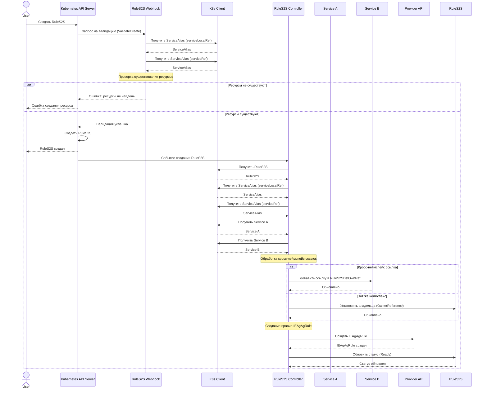

# Сценарий 9: Создание правила RuleS2S для взаимодействия между сервисами

## Описание

В этом сценарии пользователь создает правило RuleS2S, которое определяет взаимодействие между двумя сервисами в разных неймспейсах. На основе этого правила система автоматически создает соответствующие правила IEAgAgRule в провайдере, которые определяют правила доступа между группами адресов.

## Последовательность действий



## Детали реализации

1. Пользователь отправляет запрос на создание ресурса RuleS2S через Kubernetes API.
2. API-сервер вызывает валидационный вебхук для RuleS2S.
3. Вебхук проверяет:
   - Существование ServiceAlias, указанного в serviceLocalRef
   - Существование ServiceAlias, указанного в serviceRef
4. Если все проверки пройдены успешно, ресурс создается.
5. Контроллер RuleS2S обрабатывает событие создания:
   - Получает связанные ServiceAlias и Service
   - Обрабатывает кросс-неймспейс ссылки
   - Создает правила IEAgAgRule на основе адресных групп и портов сервисов
   - Обновляет статус RuleS2S

## Примеры

### Пример 1: Правило ingress

```yaml
apiVersion: netguard.sgroups.io/v1alpha1
kind: RuleS2S
metadata:
  name: ingress-example
  namespace: database
spec:
  traffic: ingress
  serviceLocalRef:
    apiVersion: netguard.sgroups.io/v1alpha1
    kind: ServiceAlias
    name: service-B
  serviceRef:
    apiVersion: netguard.sgroups.io/v1alpha1
    kind: ServiceAlias
    name: service-A
```

Результирующий IEAgAgRule:

```yaml
apiVersion: provider.sgroups.io/v1alpha1
kind: IEAgAgRule
metadata:
  name: ingress-database-backend-tcp
  namespace: client-B
spec:
  transport: TCP
  addressGroup:
    apiVersion: provider.sgroups.io/v1alpha1
    kind: AddressGroup
    name: backend
    namespace: client-A
  addressGroupLocal:
    apiVersion: provider.sgroups.io/v1alpha1
    kind: AddressGroup
    name: database
    namespace: client-B
  traffic: INGRESS
  ports:
    - d: "5432"
  action: ACCEPT
  logs: true
  priority:
    value: 100
```

### Пример 2: Правило egress

```yaml
apiVersion: netguard.sgroups.io/v1alpha1
kind: RuleS2S
metadata:
  name: egress-example
  namespace: database
spec:
  traffic: egress
  serviceLocalRef:
    apiVersion: netguard.sgroups.io/v1alpha1
    kind: ServiceAlias
    name: service-B
  serviceRef:
    apiVersion: netguard.sgroups.io/v1alpha1
    kind: ServiceAlias
    name: service-A
```

Результирующий IEAgAgRule:

```yaml
apiVersion: provider.sgroups.io/v1alpha1
kind: IEAgAgRule
metadata:
  name: egress-database-backend-tcp
  namespace: client-A
spec:
  transport: TCP
  addressGroup:
    apiVersion: provider.sgroups.io/v1alpha1
    kind: AddressGroup
    name: backend
    namespace: client-A
  addressGroupLocal:
    apiVersion: provider.sgroups.io/v1alpha1
    kind: AddressGroup
    name: database
    namespace: client-B
  traffic: EGRESS
  ports:
    - d: "80,443"
  action: ACCEPT
  logs: true
  priority:
    value: 100
```

## Особенности

1. **Направление трафика**:
   - **ingress**: Локальный сервис (serviceLocalRef) является получателем трафика
   - **egress**: Локальный сервис (serviceLocalRef) является отправителем трафика

2. **Порты**:
   - Для правил используются порты сервиса-получателя
   - Поддерживаются различные форматы портов: одиночные, списки, диапазоны

3. **Кросс-неймспейс ссылки**:
   - Если RuleS2S находится в другом неймспейсе, чем целевой сервис, создается запись в RuleS2SDstOwnRef
   - При удалении сервиса связанные правила RuleS2S удаляются автоматически